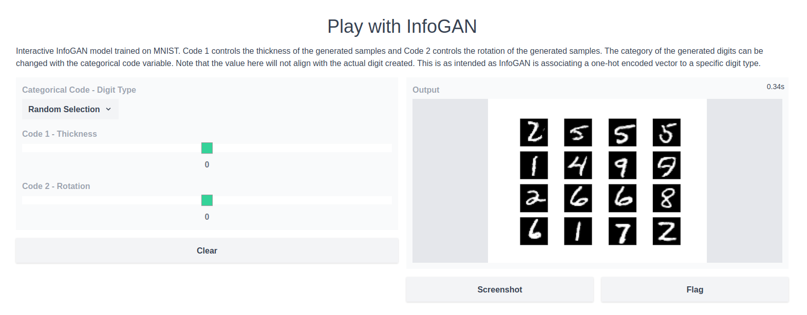

# Jax InfoGAN
Flax implementation of [InfoGAN: Interpretable Representation Learning by Information Maximizing Generative Adversarial Nets](https://arxiv.org/abs/1606.03657)

## (Very Short) Description

InfoGAN proposes an updated loss function for GANs to learn a disentangled representation by adding an "information regularization" term to the standard GAN loss function. 

The information regularization term approximates the mutual information between a subset of the noise variable, called codes and the output from the generator. The inclusion of this term in the loss encourages the codes to be connected to meaningful concepts of the generated samples such as scale, thickness, or rotation. 

## Usage
Configuration is handled with [Hydra](https://hydra.cc/). The default MNIST config contains the following:

```yaml
training:
  epochs: 101
  workers: 4
  batch_size: 128
  weight_decay: 0
  mixed_precision: False 
  discriminator_lr: 2e-4
  generator_lr: 1e-3
  lambda_cat: 1.0
  lambda_cts: 0.1

model:
  num_noise: 62
  num_cts_codes: 2
  num_cat_codes: 1
  num_categories: 10

data:
  dataset: 'MNIST'
```
To train InfoGAN on MNSIT, run:
```
python main.py
```
Training for 100 epochs with full precision takes around 35 minutes on an RTX 2080. 

## Results

Full training results and visualizations are hosted on Weights and Biases [here](https://wandb.ai/bfattori/InfoGAN).

## Gradio
The trained model can also be run in a small [Gradio](https://gradio.app/) app. 


To run the model locally:
```
python app.py
```

## Tests
Basic tests for models, loss functions and generation code.
```
python -m pytest
```
   
## References
- Xi Chen, Yan Duan, Rein Houthooft, John Schulman, Ilya Sutskever, Pieter Abbeel. InfoGAN: Interpretable Representation Learning by Information Maximizing Generative Adversarial Nets. [arxiv](https://arxiv.org/abs/1606.03657)
- https://github.com/Natsu6767/InfoGAN-PyTorch is a very helpful repo.
- https://github.com/bilal2vec/jax-dcgan is a good reference for working with GANs in Jax. 
